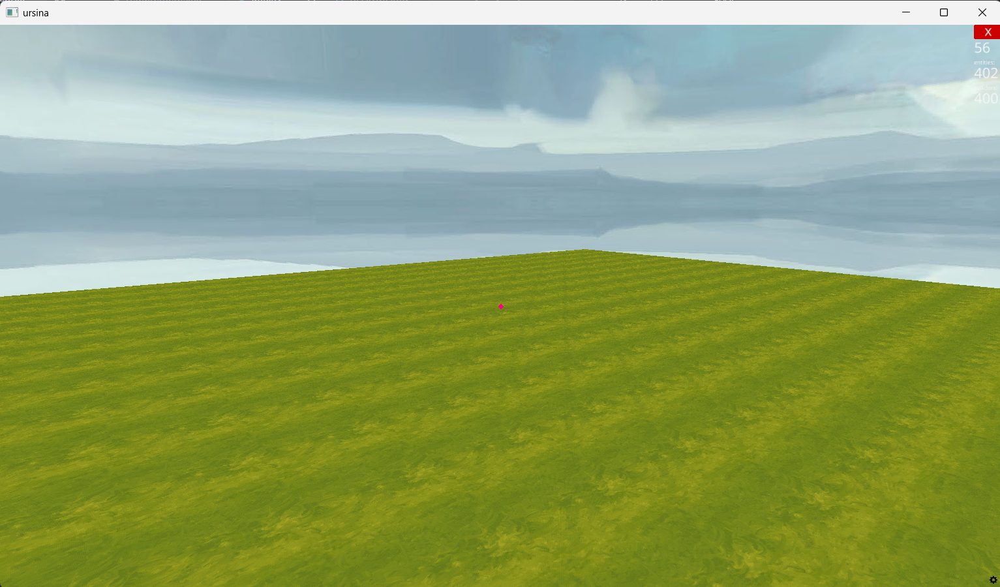
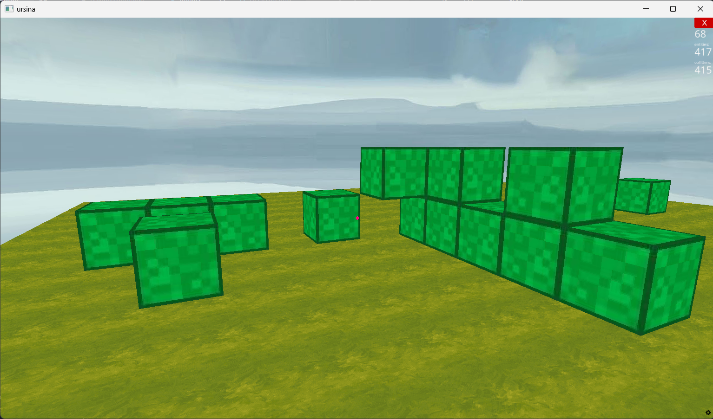

# 🧱 Simple Minecraft Clone (Ursina Engine)

A very basic **Minecraft-style sandbox game** built using the **Ursina Engine (Python)**. This project demonstrates first-person movement, block placement, and block destruction using mouse input.

---

## 🎮 Features

* First-person player controller
* Flat grass world (20×20 grid)
* Place blocks with **Left Mouse Click**
* Destroy blocks with **Right Mouse Click**
* Simple sky environment
* Beginner-friendly Ursina example

---

## 🛠️ Technologies Used

* **Python 3**
* **Ursina Game Engine**

---

## 📸 Screenshots

### World View


### Block Placement


--- 

## 📂 Project Structure

```
SIMPLE_MINECRAFT/
│── app.py
│── Photos/
│    │──grass.jpeg
│    │──
│── reyirements.txt
│── README.md
```

---

## ⚙️ Installation & Setup

### 1️⃣ Install Python

Download and install Python (3.8 or above):

* [https://www.python.org/](https://www.python.org/)

Make sure Python is added to PATH.

---

### 2️⃣ Install Ursina

Run the following command in terminal or command prompt:

```bash
pip install ursina
```

---

### 3️⃣ Run the Game

Navigate to the project folder and run:

```bash
python main.py
```

---

## 🎯 Controls

| Action       | Control            |
| ------------ | ------------------ |
| Move         | W A S D            |
| Look Around  | Mouse              |
| Jump         | Space              |
| Place Block  | Left Mouse Button  |
| Remove Block | Right Mouse Button |

---

## 🧠 How It Works

* A 20×20 grid of cube blocks is generated using nested loops
* Each block is a `Button` entity
* Mouse input detects hovered blocks
* Left click places a new block adjacent to the selected block
* Right click destroys the selected block

---

## 🚀 Future Improvements

* Texture variation
* Inventory system
* Save & load world
* Different block types
* Enemies and survival mode

---

## 📸 Preview

> A simple Minecraft-like world where you can build and destroy blocks freely.

---

## 👨‍💻 Author

**Midhunesh s**
Student | Python & Game Development Enthusiast

---

## 📜 License

This project is for **educational purposes** and personal learning.
Feel free to modify and experiment with it 😊

---

✨ *Happy Coding & Block Building!* 🧱
